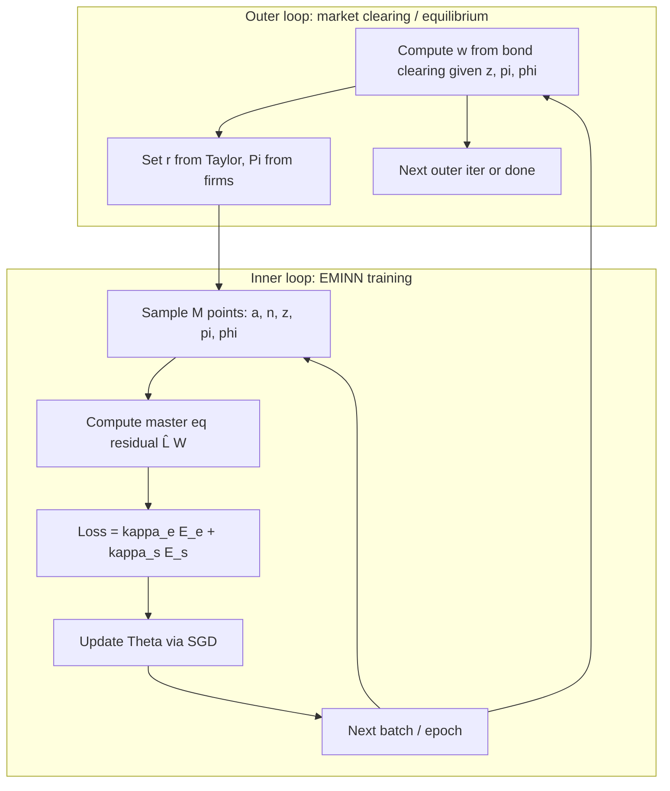

# Deep HANK: Code Implementation Writeup Plan

## Scope and conventions

- **Writeup location**: [Deep HANK - Code Model 3.md](Deep HANK - Code Model 3.md) (exception to edit; add `<!-- amp-managed -->` at end).
- **Theoretical source**: [Overleaf/main.tex](Overleaf/main.tex) / [Models/Model_simplified_WIP_ver2.pdf](Models/Model_simplified_WIP_ver2.pdf).
- **Primary references**: 08-SolvingKS_Master.pdf (finite population, envelope/W, algorithm, Ito, simulation), GLMP_EMINN.pdf (market clearing, sampling, EMINN), sample code (PS3 notebook, Seung’s nn_finag, ks_nn_crra).
- **Style**: Concise; back key choices with short reasoning.

---

## 0. Primitives and calibration table

**Model primitives (from main.tex):**

- Households: continuum i ∈ [0,1]; state (a, n) with a ≥ ā; Poisson employment n ∈ {n₁, n₂} with intensities λ(n); no labor/portfolio choice; profits and adjustment-cost rebate distributed equally; beliefs (r̃, w̃, Π̃).
- Firms: final good CES(ε); intermediate goods Y_j = Z n_j; log TFP z: **dz = μ_z(z) dt + σ_z dW⁰** (Brownian-driven diffusion; drift μ_z unspecified in theory); Rotemberg cost (ψ/2)π²Y; NKPC and r = r* + (φ_π − 1)π.
- Equilibrium: labor market Y/e^z = N* = ∑_j n_j ∫ g(a,n_j)da; bond market ∑_j ∫ a g(a,n_j)da = 0; goods market redundant; wage w from bond clearing given (z, π, g).

**Calibration table:**

| Parameter                | PS3 / Seung source           | Deep HANK use                                     | Note                                             |
| ------------------------ | ---------------------------- | ------------------------------------------------- | ------------------------------------------------ |
| γ                        | 2.1                          | 2.1                                               | CRRA                                             |
| ρ                        | 0.05                         | 0.05                                              | Discount                                         |
| r                        | 0.06 (PS3), 0.012 (Seung eq) | —                                                 | Our r = r* + (φ_π−1)π endogenous                 |
| w                        | 1.0 (PS3), 1.15 (Seung)      | Endogenous via bond clearing                      |                                                  |
| n₁, n₂                   | 0.3, 1 + (λ₂/λ₁)(1−n₁)       | Same                                              | Two-state labor                                  |
| λ₁, λ₂                   | 0.4, 0.4                     | 0.4, 0.4                                          | Poisson intensities                              |
| a_bar                    | 1e-6 (PS3), 1e-2 (Seung)     | **Recommend: negative a_bar (e.g. −2 to −0.5)**   | Allow borrowing; soft penalty below a_lb         |
| a_max                    | 20                           | 20                                                | Upper wealth grid                                |
| a_lb (penalty threshold) | 0.5 (PS3), 1.0 (Seung)       | Choose < a_max so penalty active on [a_bar, a_lb] |                                                  |
| κ                        | 3.0                          | 3.0                                               | Penalty curvature                                |
| ε, ψ, φ_π, r*            | —                            | Add from NK literature                            | Elasticity, Rotemberg, Taylor, neutral rate      |
| μ_z, σ_z                 | —                            | See “TFP process” below                           | Theory: dz = μ_z(z)dt + σ_z dW⁰; μ_z unspecified |
| N (agents)               | —                            | **25**                                            | Finite population; LLN for aggregates            |

**TFP process — theory vs KS / GLMP:**

- **Theoretical source (main.tex)**: “Only Brownian TFP shocks” and dz_t = μ_{zt} dt + σ_z dW_t^0 (later μ_z(z_t)). So the **shock** is Brownian (dW⁰); the **drift μ_z(z)** is not specified. So the model is a **Brownian-driven diffusion**; we are free to set μ_z = 0 (pure Brownian / random walk in log TFP) or add mean reversion.
- **08-SolvingKS**: Uses **Ornstein–Uhlenbeck**: μz(z) = η(z̄−z) in both the Lz operator (p.269: ∂_z W · η(z−z̄) + ½σ²∂*zz W) and in the simulation (p.229: z*{t+Δt} = z_t + η(z̄−z_t) + σ ΔB⁰_t). So KS implements mean-reverting TFP.
- **GLMP**: Generic dzt = μz(zt)dt + σz(zt)dB⁰_t (Section 2.1); no specific choice.
- **Recommendation for write-up**: (1) State theory as **dz = μ_z(z) dt + σ_z dW⁰** with μ_z unspecified. (2) For implementation use **OU** (μ_z(z) = η(z̄−z)) to align with 08-SolvingKS and keep z in a bounded range. Calibrate σ_z (and if OU: η, z̄).

**Utility: CRRA vs log — does log shut down interesting channels?**

- **Theoretical source**: main.tex uses u(c) and (u')^{-1} but does **not** specify functional form; theory is agnostic.
- **Reference implementations**: PS3, Seung (nn_finag), ks_nn_crra, aiy_fd_crra all use **CRRA** u(c) = c^{1−γ}/(1−γ) with γ = 2.1 (PS3/Seung).
- **Recommendation: use CRRA** (e.g. γ ∈ [1.5, 3]). **Log (γ→1)** would dampen or shut down channels we care about in HANK:
  - **Precautionary saving**: Prudence = γ + 1; log gives 2, CRRA γ=2.1 gives 3.1. Log weakens precautionary saving and wealth accumulation at the bottom, so the distribution is less “interesting.”
  - **Distributional sensitivity**: With γ > 1, marginal utility u'(c) = c^{−γ} is more curved; inequality and low-consumption states matter more for welfare and for equilibrium (e.g. bond demand). Log (γ=1) flattens this.
  - **EIS**: EIS = 1/γ; log fixes EIS = 1. With CRRA we can match empirical EIS and get different consumption/saving responses to r and uncertainty.
- **Write-up**: State that we adopt **CRRA** u(c) = c^{1−γ}/(1−γ), γ = 2.1 (or chosen calibration), and briefly note that log utility would reduce precautionary motive and distributional curvature and is therefore not used for this exercise.

**Parameters that do not apply or differ:**

- α, δ (capital share, depreciation): no capital in this HANK; omit.
- a_bar: set **below zero** to allow borrowing (e.g. −1 or −2); choose a_lb > a_bar for a meaningful penalty band.

**Aggregate variables that map from distribution (and why N=25 is enough):**

- **N*** = ∑_j n_j ∫ g(a,n_j)da (labor supply). With finite population: (1/N)∑_i n^i → N*.
- **Bond clearing** → wage w(z, π, φ): 0 = (1/N)∑_i a^i; w is then determined so that savings decisions are consistent (in equilibrium).
- **LLN**: For pricing/market clearing we only need distribution moments (e.g. mean assets 0, labor N*); 20–40 agents suffice (08-SolvingKS p.10) because we sample (a,n) and φ separately and moments converge quickly.

---

## 1. Soft penalty function

- **Source**: [sample code/PS3 - Deep Learning W-Residual Solver.ipynb](sample code/PS3 - Deep Learning W-Residual Solver.ipynb) (psi, penalty_mask, alb), [References/GLMP_EMINN.pdf](References/GLMP_EMINN.pdf) Section 2.2 (flow utility penalty ψ(c, x, Q)).
- **Formula**: ψ(a) = −(κ/2)(a − a_lb)² for a ≤ a_lb; 0 otherwise. In HJB: add 1_{a≤a_lb} ψ(a) (in V-residual) or 1_{a≤a_lb} ∂_a ψ(a) (in W-residual).
- **Role**: Replace hard constraint a ≥ ā with smooth penalty so the NN sees a differentiable objective; a_lb > a_bar gives a nontrivial “near constraint” region to train on.
- **Write-up**: One short subsection: define ψ, state it enters flow utility (V) or derivative (W), and reference PS3 and GLMP for implementation.

---

## 2. Envelope and FOC: work with W = ∂_a V

- **Source**: [References/08-SolvingKS_Master.pdf](References/08-SolvingKS_Master.pdf) p.6 (Master Equation for ∂_a V).
- **Idea**: Approximate W(a,n,z,π,g) = ∂_a V instead of V. Optimal consumption: u'(c*) = W ⇒ c* = (u')^{-1}(W). Master equation in W avoids embedding the FOC inside the PDE and keeps control explicit.
- **Write-up**: (1) Define W and c*(W). (2) Write the master equation in W (from main.tex master equation, substitute V → W using envelope: drift term ∂_a V · s becomes W · s; ∂_a (…) terms become ∂_a W · s + W · ∂_a s as needed). (3) State that autodiff is applied to the NN that outputs W (or V from which W is derived), so we only need first derivatives of the network in a.

---

## 3. Gaps between theory and deep learning (non-exhaustive)

- **Infinite-dimensional g**: Replaced by finite population φ = (a^i, n^i)_{i≤N} (N=25).
- **Hard borrowing constraint**: Replaced by soft penalty (Section 1).
- **Boundary condition at ā**: Softer; optionally add boundary residual term (08-SolvingKS p.19).
- **Frechet derivative ∂V/∂g**: In finite population, becomes sum over j≠i of derivatives w.r.t. (a^j, n^j) (08-SolvingKS Ingredient 1a).
- **Market clearing**: w (and r) determined by equilibrium; in code either solved in outer loop or via “last agent” (Section 6).
- **Ito terms in (z, π, φ)**: Second-order derivatives in aggregate state; can be reduced via low-dim projection or Duarte’s F(ε) trick (Section 10).

---

## 4. NN strategy roadmap

### 4a. Simulation algorithm and transition matrix

- **Source**: [References/08-SolvingKS_Master.pdf](References/08-SolvingKS_Master.pdf) simulation steps (pp.11–12).
- **Steps**: (1) Initial g₀ (e.g. ergodic). (2) For each time step: draw ΔB⁰, update z; for k=1..N_sim draw N agents from g_t; at (z_t, φ^k_t) get r^k_t, w^k_t; average to r̄*t, w̄_t; at grid points a_m get ĉ(·); build **transition matrix A_t** from KFE; update g*{t+Δt} = (I − A_t^T Δt)^{-1} g_t (implicit).
- **Transition matrix in our context**: Discretization of the KFE operator. Our KFE: ∂_t g = −∂*a(s g) + λ(ň)g(a,ň) − λ(n)g(a,n). On a grid in a and two n states, A_t is the matrix such that dφ/dt = A_t^T φ (or φ*{t+Δt} = (I + A_t^T Δt)φ for explicit), where the KFE is approximated by finite differences in a and the Poisson terms for n. So A_t encodes advection (s) and employment switching.
- **Optimization**: Simulation itself is deterministic given policy; “optimization” is the outer training loop (minimize master-equation residual) and any outer loop for market clearing (Section 6).

### 4b. NN setup

- **Inputs**: ω = (a^i, n^i, z, π, φ^{-i}) or (a, n, z, π, φ) with φ = (a^j, n^j)_{j≤N} (finite population). For symmetry, agent i sees φ^{-i} for pricing (GLMP 3.1).
- **Output**: W(ω). Output activation: e.g. softplus for positivity of W (08-SolvingKS p.15).
- **Architecture**: Fully connected feedforward; e.g. 5 hidden layers, 64 units, tanh (08-SolvingKS); input normalization (a,n,z,π scaled).

### 4c. EMINN algorithm — what is computed by autodiff

- **Algorithm**: Initialize Θ; while loss > tol: sample M points (a, n, z, φ); compute E = κ_e E_e + κ_s E_s; Θ ← Θ − α ∇_Θ E.
- **E_e**: Mean squared master-equation residual |L̂ W|² (or L̂ V) at sample points.
- **Objects computed by autodiff**: (i) W (or V) and ∂_a W, ∂_z W, ∂*π W; (ii) ∂*{a^j} W for j≠i (for L_g term); (iii) if using V, also ∂_aa V, ∂_za V for shape penalties. All derivatives in L̂ come from the same graph as the NN output.
- **Shape constraints**: E_s penalizes “wrong” shape: e.g. ∂_aa V < 0 (concavity in a), ∂_za V < 0 (08-SolvingKS table p.20). For W: W decreasing in a (∂_a W < 0) where appropriate. Add κ_s E_s to loss; κ_e=100, κ_s=1 in 08-SolvingKS finite-agent.

### 4d. Warm-start and curriculum

- **Warm-start**: Fit to a closed-form proxy. Example: V₀(a,n) = ρ^{-1} (w n + r a)^{1−γ}/(1−γ) (PS3) with fixed (r,w) or steady-state (r,w). Reduces initial residual and improves conditioning.
- **Curriculum**: (1) Train on warm-start loss only; (2) blend: α·warmstart_loss + (1−α)·pde_loss with α decaying 1→0 (PS3 curriculum step); (3) then pde_loss only. Optionally start with smaller σ_z or no π (simpler aggregate) then ramp up.

---

## 5. Implementation tricks

### 5a. From 08-SolvingKS and Seung

- **08-SolvingKS**: Moment sampling for φ (sample r or key moments, then positions); active sampling for (a,n); shape penalties ∂_aa V, ∂_za V < 0; initialization W(a,·)=e^{−a} or similar; boundary oversampling (PS3 boundary_frac); gradient clipping; cosine LR decay.
- **Seung (nn_finag)**: N_pop=41; steady-state distribution from FD (stat_dist_fd_Seung.csv); Beta-sampling for moments (k_impl, var_a); calc_eqm from (Z, L, k) → r, w; mixture of uniform and moment-consistent samples.

### 5b. Sampling most suited to our setting

- **Recommendation**: **Moment-based sampling for φ** (08-SolvingKS, GLMP): Our prices (w, r) depend on bond clearing (mean assets = 0) and labor N*. So: (1) Draw z, π (and optionally moments that matter); (2) Draw N−1 agent states (a^j, n^j) consistent with zero mean assets and target N* (or draw from a distribution that approximates ergodic); (3) Set last agent’s state or rescale so ∑_i a^i = 0. This keeps training in the economically relevant subspace.
- **(a,n)**: Uniform over [a_bar, a_max] × {n₁,n₂} plus boundary oversampling near a_bar and a_lb (PS3).
- **z, π**: Uniform over [z_min, z_max], [π_min, π_max] or from a simple law of motion.

### 5c. Avoiding cheat solutions

- **Cheat solutions**: Constant V, non-increasing in a, non-concave (08-SolvingKS p.19).
- **Mitigations**: (1) Shape penalties E_s (∂_aa V < 0, ∂_a W < 0). (2) Warm-start toward sensible V₀. (3) Initialize so W is decreasing in a (e.g. init with e^{−a}). (4) Boundary oversampling so residual is enforced near a_bar. (5) Curriculum so the solver first fits a “good” shape then refines residual.

### 5d. Suggestions from 08-SolvingKS for calibration/init/algorithm

- **Calibration**: If training is unstable, reduce σ_z or shrink (z, π) range; or train first with fixed z (Aiyagari-like) then add aggregate shocks.
- **Initialization**: V or W init as in 08-SolvingKS table (e.g. W(a,·)=e^{−a}); avoid zeros that lead to flat gradients.
- **Algorithm**: Howard-style iteration (fix policy, update V for several steps) can help; 08-SolvingKS uses shape constraints instead of false time step. Consider κ_e > κ_s early, then balance.

---

## 6. Inflation and market clearing — outer loop and “last agent”

- **Inflation in our model**: π is an aggregate state with NKPC: dπ = μ_π(z,π,g) dt − σ_z π dW⁰; μ_π includes r*π + (φ_π−1)π² + (ε/ψ)((ε−1)/ε − w/e^z) − (μ_z − σ_z²/2)π. So π is not a market-clearing price in the same way as w; it evolves by NKPC and belief consistency.
- **Market clearing**: Labor gives Y = e^z N* (and N* from g). Bond market 0 = ∑_j ∫ a g(a,n_j)da pins down **w** given (z, π, g) — wage adjusts so that household saving decisions clear the bond market. In finite population: 0 = (1/N)∑_i a^i; w is the price that achieves this in equilibrium.
- **Outer loop (GLMP-style)**: Master equation is solved given q = (r, w, Π); in equilibrium q = Q(z, g). **Outer loop**: (1) Given current NN (W or V), at each sampled (z, φ) compute equilibrium w (and r, Π) from bond clearing (and r = r* + (φ_π−1)π). (2) Train NN to minimize residual with this q. (3) Iterate. So “outer” = market-clearing / equilibrium price update; “inner” = SGD on master-equation residual.
- **“Last agent” mechanically satisfies market clearing**: Instead of solving 0 = (1/N)∑*i a^i for w, fix N−1 agents’ (a^j, n^j) and set a^N = −∑*{i=1}^{N−1} a^i so bond market holds by construction. Then the Nth agent’s consumption/saving is implied (their state is determined). **Why it can help**: (1) Removes one degree of freedom and ensures every batch satisfies bond clearing. (2) Reduces need to invert “w given φ” during training. (3) Can stabilize learning by avoiding inconsistent (φ, w) pairs. **Caveat**: Agent N is not price-taking in the same way; it’s a computational device. In the write-up: state the idea, that it enforces clearing by construction and can improve stability, and that the standard alternative is GLMP’s price-taking with Q(z, φ^{-i}) and an outer loop that computes w from clearing.

---

## 7. Where to sample — diagnostic output

- **Mechanism**: **Active sampling** (08-SolvingKS, Gopalakrishna): Periodically evaluate master-equation residual on a fixed or random grid; record residual by region (e.g. bins of (a, n, z, π) or by quantiles of (a, z)). Output a **test report**: e.g. (1) MSE of residual by (a_bin, n), (2) max residual and its location (a*, n*, z*, π*), (3) histogram of residuals. This “informs where to sample”: add more points in high-residual regions in the next training phase.
- **Concrete test output**: A table or plot: columns (a_bin, n, z_bin, π_bin), rows (mean_residual, max_residual, count); or a 2D map of mean residual in (a, z) for fixed n, π. Log this every K epochs and optionally feed high-error cells into the sampler.

---

## 8. Mermaid: outer vs inner loops

- **Inner**: Sample → residual → loss (with shape) → SGD; repeat. **Outer**: Given current NN, recompute equilibrium (w, r, Π) from clearing; then resume inner, or alternate.

---

## 9. Other important points from 08-SolvingKS

- **Testing**: Compare to a known solution (e.g. Aiyagari with fixed z): MSE of V or W vs FD (08-SolvingKS p.22).
- **Howard improvement**: Fix policy c* for several iterations and only update V/W to stabilize (08-SolvingKS p.21).
- **Symmetry / dimension reduction**: Optional NN that maps φ to moments then (a, n, z, moments) → V; we can start without it (08-SolvingKS p.21).
- **Boundary**: Soft penalty preferred; if adding boundary residual, sample on a = a_bar and add E_b to loss (08-SolvingKS p.19).
- **Practical lessons (08-SolvingKS p.31)**: Sampling is critical; smooth constraints help; shape constraints help speed and stability; start from a simpler (e.g. no aggregate shock) model to tune.

---

## 10. Ito terms in our setting

- **Concern in general**: Master equation has terms D_s W^T μ(s) + (1/2)Tr(σ(s)^T D²_s W σ(s)) for s = (z, π, φ). With high-dim φ, many second derivatives (e.g. ∂²W/∂φ_j ∂φ_k) are costly and can be noisy.
- **In our setting**: (1) **z**: One-dimensional; ∂_z W, ∂_zz W are cheap. (2) **π**: One-dimensional; ∂*π W, ∂ππ W are cheap. (3) **φ**: 2N (a^i, n^i); N=25 ⇒ 50 dimensions; ∂{φ_j} W and ∂²*{φ_j φ_k} W are numerous.
- **Why less of a concern here**: (1) We use **finite population**; L_g in 08-SolvingKS is a sum over j≠i of ∂_{a^j} W · μ_a^j + jump terms — first derivatives only in φ, no second-order Ito term in φ because agent states evolve by drift + Poisson (no diffusion in a^i). (2) So the only second-order terms are in **z** and **π** (∂_zz W, ∂_ππ W), which are 2D and manageable.
- **Conclusion**: Ito terms are **not** a major concern: no diffusion in φ, and z, π are low-dimensional. If we later use a projection in φ (e.g. moments), then Duarte’s F(ε) trick (08-SolvingKS p.30) can reduce derivative count for the Ito correction in that subspace.

---

## Suggested order of sections in the write-up

1. Primitives and calibration (Section 0) + table
2. Soft penalty (1) and envelope/W (2)
3. Gaps (3)
4. Roadmap: simulation (4a), NN (4b), EMINN (4c), warm-start (4d)
5. Implementation tricks (5a–5d)
6. Inflation and market clearing (6) + last-agent paragraph
7. Where to sample (7) + test output spec
8. Mermaid diagram (8)
9. Other 08-SolvingKS points (9)
10. Ito terms (10)

Use equations from main.tex for master equation, NKPC, and s, μ_π, μ_g, r(z,π,g); keep notation consistent with the LaTeX source.