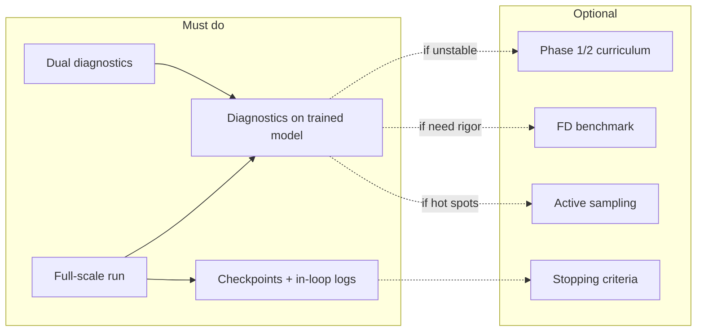

# Strategy: What to Do Next to Finish the Deep HANK Solution

## Current state

- **Implemented**: All six modules ([config.py](deep_hank/config.py), [model.py](deep_hank/model.py), [economics.py](deep_hank/economics.py), [sampling.py](deep_hank/sampling.py), [residual.py](deep_hank/residual.py), [train.py](deep_hank/train.py)), plus [simulation.py](deep_hank/simulation.py) (Level-1 replay) and [diagnostics.py](deep_hank/diagnostics.py). Four-phase training runs; [run_diagnostics.py](scripts/run_diagnostics.py) executes a **short** run (80+80+80+40 steps) and produces loss curves, residual heatmaps, wage-clearing and policy plots, and a report.
- **Spec vs code**: The writeup ([Deep HANK - Code Model 3.md](Deep HANK - Code Model 3.md)) and JAX plan ([.cursor/plans/deep_hank_jax_code_d554b3b4.plan.md](.cursor/plans/deep_hank_jax_code_d554b3b4.plan.md)) describe a few training and validation features that are **not** yet wired in.
- **Dual diagnostics**: The [dual human-machine diagnostics plan](.cursor/plans/dual_human-machine_diagnostics_5d35396b.plan.md) defines paired outputs (human: plot + interpretation; machine: JSON + pass rules) and is incorporated below.

---

## Recommended order of work

### 1. Validate at full scale and confirm convergence (priority)

- **Run production-length training** using [config.py](deep_hank/config.py) defaults: `phase0_steps=1500`, `phase1_steps=3000`, `phase2_steps=5000`, `phase3_steps=10000` (total 19,500 steps).
- **After the run**, execute the diagnostic suite on the trained model (same flow as `run_diagnostics.py` but without shortened steps). Once dual diagnostics (section 2) are in place, inspection uses both:
  - **Human**: Plots + INTERPRETATION.md (what good/bad looks like, implications).
  - **Machine**: JSON artifacts and `diagnostics.json` summary; optional pass/fail from thresholds for CI or regression.
- **Metrics to inspect**: Loss curves (residual MSE, shape loss trending down); wage-clearing (mean/max |F(w)|); residual heatmaps (log10|R| by (a,z)); simulation paths and asset hist (bounded, mean(a) near 0). For autopilot, these are encoded in the dual JSON artifacts; no human inspection required.
- **Outcome (machine-decidable)**: After dual diagnostics are in place, outcome = pass/fail from `diagnostics.json` using config thresholds. On pass: document baseline (e.g. write summary to report or JSON). On fail: produce a structured failure report (which thresholds failed, values vs bounds) and optionally run a remediation branch (see Autopilot execution).

**Concrete steps**: Add a script or CLI (e.g. `scripts/run_full_training.py` or `python -m deep_hank.train --full`) that runs with default config, saves model and history to e.g. `outputs/` or `checkpoints/`, then runs the diagnostic suite and writes all outputs (including dual artifacts once implemented) into the same directory.

---

### 2. Dual human-machine diagnostics (priority; feeds step 1)

Refactor diagnostics so every check yields **two paired outputs** (see [dual human-machine diagnostics plan](.cursor/plans/dual_human-machine_diagnostics_5d35396b.plan.md)):

- **Human**: Existing PNGs plus a single **INTERPRETATION.md** (one section per diagnostic: which plot(s), what "good" vs "bad" looks like, one-sentence implication). No machine parsing of this file.
- **Machine**: For each diagnostic, write a **JSON** with fixed schema; machines never parse images. Add a top-level **diagnostics.json** (manifest: run_id, config_snapshot, paths to artifact JSONs, aggregated **summary** scalars, and a **pass** boolean from explicit rules).

**Per-diagnostic machine artifacts and pass rules (summary):**

| Diagnostic        | JSON file              | Key summary fields                                  | Example pass rule                                            |
| ----------------- | ---------------------- | --------------------------------------------------- | ------------------------------------------------------------ |
| Loss curves       | loss_curves.json       | final.residual_mse, final.shape_loss                | residual_mse_final < threshold, shape_loss_final < threshold |
| Residual heatmaps | residual_heatmaps.json | n_low/n_high max/mean log10                         | R                                                            |
| Wage clearing     | wage_clearing.json     | mean_abs, p95_abs, max_abs                          | p95_abs < 1e-4, max_abs < 5e-4                               |
| Policy slices     | policy_slices.json     | min_dW_da, min_dc_da, monotonicity_violations_W/c   | violations == 0 or min slopes > 0                            |
| Sim paths         | sim_paths.json         | final.mean_a_abs, std_a, share_high; has_nan_or_inf | no NaNs, share_high in [0.01,0.99], max_abs_mean_a < 0.5     |

**Implementation (in [deep_hank/diagnostics.py](deep_hank/diagnostics.py)):** Each plotting function also writes the corresponding JSON (same data as plot, plus summary scalars). Add `write_interpretation_md(outdir)` and `write_diagnostics_manifest(outdir, run_id, config_snapshot, artifacts, summary, pass)`. **Config**: Add optional keys e.g. `diag_pass_residual_mse_max`, `diag_pass_w_clear_p95_max`, `diag_pass_residual_log10_R_max`, `diag_pass_sim_max_abs_mean_a`; defaults loose so existing runs don't fail; CI can override. **Backward compatibility**: Keep existing report.md and PNGs; add JSONs and INTERPRETATION.md.

**Outcome**: You read plots and INTERPRETATION.md; scripts/CI read only JSON and apply the rules. Full-scale run (step 1) then produces both human and machine-actionable results.

---

### 3. Wire in-training diagnostics and checkpoints (high value, low effort)

- **Checkpoints**: Config already has `checkpoint_every` and `diagnostic_every`; [train.py](deep_hank/train.py) does not use them. In Phase 3 (and optionally Phase 2), every `checkpoint_every` steps save the current model (e.g. `equinox.serialisation.save_tree`) and a short history slice so you can resume or inspect mid-run.
- **In-loop diagnostics**: Every `diagnostic_every` steps in Phase 3, compute and log a small set of scalars without full plots: e.g. mean and 95th percentile of |residual| on a fixed small batch, mean |excess_savings| after solving for w, and optionally mean shape penalty. Log these into `state.history` (e.g. keys like `phase3_residual_mean`, `phase3_w_clear_abs`) so they appear in the same history used by `plot_loss_curves` and can be plotted later.
- **Outcome**: You can monitor convergence and wage-clearing during long runs and resume from the last checkpoint if needed.

---

### 4. Optional curriculum (Phase 1 blend, Phase 2 range)

- **Phase 1 curriculum** (writeup §C Phase 1): “Blend Phase-0 loss with steady-state PDE loss, alpha decaying 1 → 0 over ~1000 steps.” Right now Phase 1 uses only the steady-state PDE loss. Implement: for steps 0 to `phase1_alpha_steps`, set $\alpha_t = 1 - t / \text{phase1alphasteps}$, and use loss = $\alpha_t \cdot \text{warmstartloss} + (1-\alpha_t) \cdot \text{steadypdeloss}$ (with the same batch structure as Phase 0 for the warmstart part, e.g. fixed z/pi/w and dummy others). Config already has `phase1_alpha_steps`.
- **Phase 2 range** (writeup §C Phase 2): “Gradually widen (z, pi) sampling range.” Currently sampling is full range from the first step. Optional: for the first portion of Phase 2, sample (z, pi) from a narrow band around (z_bar, 0) and linearly expand to full [z_min, z_max] × [pi_min, pi_max] over `phase2_alpha_steps`.
- **When to run (autopilot)**: Enable curriculum if first run fails on `residual_mse_final` or `shape_loss_final` (training/convergence issue). Use diagnostics.json; no human "inspect for instability" needed.

---

### 5. Optional validation and refinement

- **Active sampling** (writeup Phase 3): “Add extra points where residual is large.” After every K epochs, evaluate residual on a large batch, identify states where |R| is above a percentile (e.g. 90th), and mix a fraction of these into the next batches. **When to run (autopilot)**: Enable if first run fails on residual heatmap summary (e.g. residual_heatmap_max_log10_R above threshold); no human "see hot spots" needed.
- **Convergence stopping**: No automatic stopping today; training runs a fixed number of steps. Optional: stop Phase 3 when a rolling average of residual MSE and/or wage-clearing error falls below thresholds for a given number of consecutive checks. Fully machine-decidable once thresholds are in config.

---

## Dependency overview

---

## Autopilot execution (machine-only workflow)

An agent or script can run the following **without human decisions** if the preconditions are met:

1. **Precondition**: Config includes pass thresholds (e.g. `diag_pass_residual_mse_max`, `diag_pass_w_clear_p95_max`, `diag_pass_residual_log10_R_max`, `diag_pass_sim_max_abs_mean_a`). Defaults or a single `diag_pass.json` can supply them so no human is needed to "inspect" after the run.
2. **Implement dual diagnostics** (section 2): In `diagnostics.py`, each plotting function writes the corresponding JSON; add `write_interpretation_md(outdir)` and `write_diagnostics_manifest(outdir, run_id, config_snapshot, artifacts, summary, pass)`. Compute `pass` by applying the threshold rules to the summary scalars (no image parsing).
3. **Implement full-train + diagnose entry point**: One script/CLI that (a) runs training with default config (or config from env/file), (b) saves model and history to a timestamped output dir, (c) runs the full diagnostic suite, (d) writes all dual artifacts (PNGs, JSONs, INTERPRETATION.md, report.md, diagnostics.json). No human in the loop.
4. **Decide outcome from JSON only**: After the run, the agent loads `diagnostics.json`. If `pass === true`, treat as success: optionally write a one-line "PASS" to a log or report. If `pass === false`, derive **failure mode** from the same JSON (e.g. which threshold failed: `residual_mse_final`, `w_clear_p95_abs`, `residual_heatmap_max_log10_R`, `sim_has_nan_or_inf`, etc.) and either: (A) write a structured failure report (which checks failed, values vs thresholds) for later human review, or (B) run a **remediation branch** (see step 5). No human needed to "inspect plots" or "decide if good enough."
5. **Optional remediation branches (machine-decided)**:
  - If `residual_mse_final` failed and no curriculum yet: re-run with Phase 1 curriculum enabled (blend warmstart + steady PDE) and Phase 2 range curriculum enabled.
  - If `residual_heatmap_max_log10_R` failed (hot spots): re-run with active sampling enabled (add points where |R| is large).
  - If `w_clear_p95_abs` failed: re-run with tighter wage-solver tolerance or more bisection steps (config change only).
  - Cap remediation at one or two retries to avoid infinite loops; then emit failure report.
6. **Checkpoints and in-loop logs** (section 3): Implement saving and logging so that if the process is killed, an autopilot can **resume from last checkpoint** (load model, restore step count, continue Phase 3). No human needed to "monitor" mid-run; logs are for post-hoc or CI.

With the above, the only human-free loop is: **run entry point → read diagnostics.json → pass → done; or fail → remediation branch (or write failure report) → done.**

---

## Where the current plan still needs human involvement

These are the **only** points that remain human-dependent after the autopilot workflow is in place:

| Touchpoint                                    | Why human                                                                                                                 | How to reduce or keep                                                                                                                      |
| --------------------------------------------- | ------------------------------------------------------------------------------------------------------------------------- | ------------------------------------------------------------------------------------------------------------------------------------------ |
| **Setting pass thresholds the first time**    | Someone must choose e.g. `residual_mse_final < 1e-3` vs `1e-4` (tight vs loose).                                          | Keep: one-time or per-project config; autopilot reads config.                                                                              |
| **Deciding “relax threshold” vs “fix model”** | When run fails, human may prefer to relax the threshold for an acceptable run rather than add curriculum/active sampling. | Optional: autopilot can emit "failed (reason X); suggest: relax threshold / add curriculum / add active sampling" and stop; human chooses. |
| **Reading INTERPRETATION.md and plots**       | Narrative and visual intuition (e.g. “hot spot near boundary”) are for human debugging and papers.                        | Keep: no machine parsing; humans use when investigating a failure or writing up.                                                           |
| **Deciding to run FD benchmark**              | FD benchmark (section 5 optional) is for rigor/publication; not required for autopilot pass.                              | Optional: autopilot never runs FD unless a flag or config says "run_fd_benchmark: true"; human sets that when needed.                      |
| **Approving remediation branches**            | Autopilot can re-run with curriculum/active sampling; human might prefer to change calibration or architecture instead.   | Optional: autopilot can do one remediation run then report; human approves further changes.                                                |

So: **autopilot can run train → diagnostics → pass/fail → optional remediation → report**, with no human in the loop. Humans are needed only for **initial threshold config**, **optional interpretation of plots/report**, and **optional approval of remediation or FD benchmark**.

---

## Summary

1. **Do first**: Run full-scale training (default config), run diagnostics on the result, and record baseline metrics. Add a single entry point (script or CLI) that does full train + save model/history + run diagnostics + write all outputs (including dual artifacts once implemented).
2. **Do second**: Implement **dual human-machine diagnostics** (per [dual human-machine diagnostics plan](.cursor/plans/dual_human-machine_diagnostics_5d35396b.plan.md)): each diagnostic writes a plot + INTERPRETATION.md content and a machine-readable JSON with summary and pass rules; add `diagnostics.json` manifest. Enables human interpretation and CI/script gating on the same run.
3. **Do third**: Implement checkpointing and in-loop diagnostic logging in [train.py](deep_hank/train.py) using existing config keys so long runs are observable and resumable.
4. **Do if needed**: Phase 1 blend and Phase 2 range curriculum; FD benchmark; active sampling; convergence-based stopping.

No changes to the master-equation residual, economics, or sampling logic are required; the pipeline is complete and the remaining work is validation at scale, dual diagnostics, and operational improvements (curriculum, checkpoints, optional refinements).

**Autopilot**: Follow the "Autopilot execution" section: implement dual diagnostics and pass rules, then a single entry point that runs train → diagnostics → read diagnostics.json for pass/fail → optional remediation or failure report. No human in the loop. **Human-only**: initial pass-threshold config; optional interpretation of plots/INTERPRETATION.md; optional approval of remediation or FD benchmark.