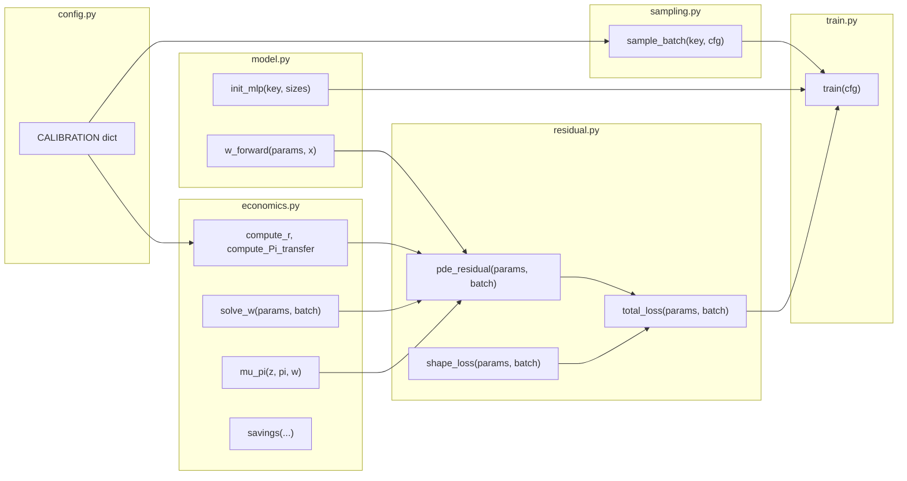

# Deep HANK: JAX Implementation Plan

## Architecture overview

Six files in `deep_hank/`, plus `requirements.txt` and `__init__.py`:

```
deep_hank/
  __init__.py
  config.py        # Parameters, calibration, ranges
  model.py         # NN architecture (W-network), forward pass
  economics.py     # Equilibrium: r, w, Pi, savings, NKPC drift, penalty
  sampling.py      # Batch sampler: (a,n,z,pi,phi), moment-based, stock-clearing projection
  residual.py      # PDE residual, shape loss, total loss
  train.py         # Training loop: warm-start, curriculum, EMINN, diagnostics
  simulation.py    # (Level-1) finite-agent path simulation + replay-buffer states (on-manifold)
requirements.txt
```




---

## 1. `config.py` — Parameters and calibration

Directly from the [calibration table](Deep HANK - Code Model 3.md) (lines 11-41). A flat Python dict `CALIBRATION` plus derived quantities:

- Derived: `n_high = 1 + (lambda_2/lambda_1)*(1 - n_low) = 1.7`
- Derived: `r_ss = r_star = 0.02`, `w_ss = 1.0` (initial guess)
- Training hyperparams: `nn_width=64`, `nn_layers=5`, `batch_size=2048`, `lr_max=1e-3`, `lr_min=1e-6`, `grad_clip=1.0`
- Phase configs: epochs per phase, curriculum decay schedule, boundary_frac per phase

---

## 2. `model.py` — NN architecture

**Framework**: JAX with [Equinox](https://github.com/patrick-kidger/equinox) for pytree-compatible modules (cleaner than raw param lists, fully compatible with `jax.grad`, `jax.vmap`, `jax.jit`).

**Architecture** (from writeup Section 4b):

- Input dim: `2 + 3 + 2*(N-1) = 53` for N=25 — `(a_i, n_i, z, pi, w, a_1,...,a_{N-1}, n_1,...,n_{N-1})`
- 5 hidden layers, 64 units each, `tanh` activation
- Output: scalar, wrapped in `jax.nn.softplus(...)` for positivity (`W > 0`)
- Initialization: He normal (as in PS3)

**Input normalization** (inside forward pass):

- `a_norm = (a - a_mid) / a_scale` where `a_mid = (a_max + a_bar)/2`, `a_scale = (a_max - a_bar)/2`
- `n_norm = (n - n_mid) / n_scale` with `n_mid = (n_low + n_high)/2`
- `z_norm = z / (z_max - z_min)`, `pi_norm = pi / (pi_max - pi_min)`
- Same normalization applied to other agents' `(a^j, n^j)`

**Key functions**:

- `init_model(key, cfg) -> model` — create Equinox MLP
- `w_forward(model, x) -> W` — forward pass returning positive scalar W
- `w_forward_batch(model, x_batch) -> W_batch` — vmapped version

---

## 3. `economics.py` — Equilibrium and pricing

**Interest rate** (Taylor rule + Fisher):

```python
def compute_r(pi, cfg):
    return cfg["r_star"] + (cfg["phi_pi"] - 1) * pi
```

**Aggregate labor** (finite population):

```python
def compute_N_star(n_all, N):
    return jnp.mean(n_all)  # (1/N) * sum_i n^i
```

**Profits / transfers** (naming note): the spec uses a profit-like object that enters households’ budget as `Pi/N` and includes the adjustment-cost rebate term (see `Deep HANK - Code Model 3.md`, note (2), and “More General Instruction” §Master equation reference).

```python
def compute_Pi_transfer(w, z, pi, N_star, cfg):
    return (1.0 - w / jnp.exp(z) + 0.5 * cfg["psi"] * pi**2) * jnp.exp(z) * N_star
```

**Wage solver (implicit equilibrium; chosen implementation)**

We treat $w$ as **implicitly defined** by the **flow-clearing** condition (spec: `Deep HANK - Code Model 3.md`, Phase 2):

$$
F(w) := \sum_{i=1}^N s^i(a^i, n^i, z, \pi, w; W_\Theta) = 0,
$$

where each $c^{*,i}(w)$ is implied by the NN output $W^i = W_\Theta(a^i,n^i,z,\pi,w,\phi^{-i})$ and $c^{*,i} = (W^i)^{-1/\gamma}$.

Implementation sketch:

- `excess_savings(model, w, z, pi, a_all, n_all, cfg) -> scalar` computes $F(w)$ by evaluating the NN for each agent `i` (focal state `i`, distribution `phi^{-i}`) and summing savings.
- `solve_w(...)` uses **bisection** with automatic bracketing; optionally switch to **Newton** after a few bisection steps using `jax.grad(excess_savings)`.

**Price-taking implementation detail (important)**: when computing PDE derivatives like $\partial_{a^i}W^i$, we treat equilibrium prices as **given**. Concretely, we solve for $w$ in an outer step, then pass `w_const = stop_gradient(w_solved)` into the residual and into the NN. This prevents backpropagating through the wage-clearing map $w(\phi)$ and keeps the residual aligned with price-taking behavior.

**NKPC drift** (from writeup Section 6.1, PDF page 10):

```python
def mu_pi(z, pi, w, cfg):
    mu_z = cfg["eta_z"] * (cfg["z_bar"] - z)
    return (cfg["r_star"] * pi
            + (cfg["phi_pi"] - 1) * pi**2
            + (cfg["epsilon"] / cfg["psi"]) * ((cfg["epsilon"] - 1) / cfg["epsilon"] - w / jnp.exp(z))
            - (mu_z - 0.5 * cfg["sigma_z"]**2) * pi)
```

**Savings rate**:

```python
def savings(a_i, n_i, c_star_i, r, w, profits_per_agent):
    return r * a_i + w * n_i - c_star_i + profits_per_agent
```

**Soft penalty** (derivative form for W-residual, from writeup Section 1):

```python
def penalty_deriv(a, cfg):
    # d/da [-kappa/2 * (a - a_lb)^2] = -kappa * (a - a_lb) for a <= a_lb
    return jnp.where(a <= cfg["a_lb"], -cfg["kappa"] * (a - cfg["a_lb"]), 0.0)
```

---

## 4. `sampling.py` — Batch generation

Three components per batch point, following writeup Section D and the "More General Instruction" Section 5b:

**(a) Aggregate states**: `z ~ Uniform[z_min, z_max]`, `pi ~ Uniform[pi_min, pi_max]`

**(b) Other agents (phi^{-i})** — moment-based + stock-clearing projection:

1. Draw `N-1` employment states `n^j` from stationary distribution: `P(n_high) = lambda_1 / (lambda_1 + lambda_2) = 0.5`
2. Draw `N-1` asset holdings `a^j ~ Uniform[a_bar, a_max]` (or Beta-matched to moments after Phase 0 produces a stationary distribution)
3. **Stock-clearing projection (preferred)**: after drawing `a_all`, enforce `sum_i a^i = 0` by centering:
  - `a_all <- a_all - mean(a_all)`.
  - Enforce bounds using rejection sampling (preferred) or clip+recenter (fallback).

Fallback: literal last-agent (`a_last = -sum_{i \neq last} a_i`) with randomized `last` index to avoid a fixed “special agent”.

**(c) Focal agent (a^i, n^i)**:

1. `n^i` drawn 50/50 (balanced)
2. `a^i ~ mixture`: with probability `boundary_frac`, draw from `[a_bar, a_lb]`; otherwise from `[a_bar, a_max]`

**Function**:

```python
def sample_batch(key, cfg, phase, boundary_frac=0.2):
    # Returns: a_i, n_i, z, pi, phi_minus_i (all arrays of shape [batch_size, ...])
```

---

## 5. `residual.py` — PDE residual and loss

This is the core module. For each sample point, compute the full master-equation residual from writeup Section A (line 83-90).

**Autodiff strategy** (JAX):

- Define a scalar function `W_scalar(model, a_i, n_i, z, pi, w, a_others, n_others)` that returns a single float
- Use `jax.grad` for first derivatives, chain for second derivatives
- Use `jax.vmap` to vectorize across the batch

**Derivatives needed** (from writeup Section E, lines 166-178):


| Derivative           | JAX computation                                  |
| -------------------- | ------------------------------------------------ |
| `W_i`                | forward pass                                     |
| `dW/da_i`            | `jax.grad(W_scalar, argnums=1)`                  |
| `dW/dz`, `d2W/dz2`   | `jax.grad(W_scalar, argnums=3)`, then chain      |
| `dW/dpi`, `d2W/dpi2` | `jax.grad(W_scalar, argnums=4)`, then chain      |
| `d2W/dzdpi`          | `jax.grad(jax.grad(W_scalar, 3), 4)`             |
| `dW/da_j` for j != i | `jax.jacrev(W_scalar, argnums=5)` or vmap over j |
| `W with n_i flipped` | forward pass with `n_check_i`                    |
| `W with n_j flipped` | batch of forward passes (vmapped)                |


**Residual assembly** (from writeup eq in Section A):

```python
def pde_residual(model, a_i, n_i, z, pi, a_others, n_others, w, cfg):
    # 1. Forward + consumption
    W_i = w_forward(model, build_input(a_i, n_i, z, pi, w, a_others, n_others))
    c_star_i = W_i ** (-1.0 / cfg["gamma"])

    # 2. Prices
    r = compute_r(pi, cfg)
    N_star = compute_N_star(...)
    Pi = compute_Pi_transfer(w, z, pi, N_star, cfg)
    s_i = savings(a_i, n_i, c_star_i, r, w, Pi / cfg["N"])

    # 3. Individual terms (Lx)
    Lx = dW_da_i * s_i + lambda_i * (W_i_flipped_n - W_i)

    # 4. Aggregate terms (Lz + Lpi + Lzpi)
    mu_z_val = cfg["eta_z"] * (cfg["z_bar"] - z)
    sig2 = cfg["sigma_z"] ** 2
    Lz = dW_dz * mu_z_val + 0.5 * sig2 * d2W_dz2
    Lpi = dW_dpi * mu_pi_val + 0.5 * sig2 * pi**2 * d2W_dpi2
    Lzpi = -sig2 * pi * d2W_dzdpi

    # 5. Distribution terms (Lg) — empirical-measure average
    Lg = (1/(N-1)) * sum_j [dW_da_j * s_j + lambda_j * (W_j_flipped - W_i)]

    # 6. Penalty + discount
    R = (r - cfg["rho"]) * W_i + penalty_deriv(a_i, cfg) + Lx + Lz + Lpi + Lzpi + Lg
    return R
```

**Shape penalty** (from writeup Section E, line 179):

- Penalize `dW/da_i > upper_bound` (W should decrease in a for concavity of V): `ReLU(dW_da_i - ub)^2`
- Penalize `dW/dz > 0` (value should increase with productivity, so W = V_a may decrease with z depending on context): `ReLU(dW_dz)^2`

**Total loss**:

```python
def total_loss(model, batch, cfg):
    R = vmap(pde_residual)(...)
    E_e = jnp.mean(R ** 2)
    E_s = shape_penalty(...)
    return cfg["kappa_e"] * E_e + cfg["kappa_s"] * E_s
```

---

## 6. `train.py` — Training loop (4 phases)

**Optimizer**: `optax.adam` with cosine decay schedule + gradient clipping (norm 1.0), following PS3 patterns.

### Phase 0: Warm-start (fit W to analytical target)

- Target: `W_target = (w_ss * n + r_ss * a + Pi_ss/N)^(-gamma)` (marginal utility at hand-to-mouth, from writeup Q7)
- Loss: MSE between `w_forward(model, x)` and `W_target`
- ~1500 steps, `boundary_frac=0.0`, `balanced_n=True`
- Only samples `(a_i, n_i)` — no aggregate states needed

### Phase 1: Steady-state PDE (no aggregate shocks)

- Fix `z = z_bar`, `pi = 0`. Drop `Lz`, `Lpi`, `Lzpi`, `Lg` terms.
- Curriculum: blend warm-start loss with steady-state PDE loss, alpha decaying 1 -> 0 over ~1000 steps
- ~3000 steps, `boundary_frac=0.2`
- Validates against finite-difference benchmark (from `aiy_fd_crra.py` sample)

### Phase 2: Full master equation (fixed w-rule)

- Turn on `(z, pi)` dynamics and `Lg` terms
- Initially use heuristic `w = w_ss` (no outer loop yet)
- Curriculum: gradually widen `(z, pi)` sampling range
- ~5000 steps, `boundary_frac=0.3`

### Phase 3: Outer loop (solve for w)

- Each batch: sample `(z, pi, phi)` with stock-clearing projection -> solve `w` via 1D root-finding on `sum_i s^i(w)=0` -> compute residual -> SGD
- `K_inner` SGD steps per w-solve (start with 1, can increase)
- ~10000 steps, with periodic diagnostic evaluation
- Convergence: monitor PDE loss, shape loss, bond-clearing error

### Diagnostics (Phase 3+)

- Every 500 epochs: evaluate residual on fixed test grid, log heatmap by `(a, z)` for each `n`
- Active sampling: add extra points where residual is large (adaptive refinement as in sample code, after epoch 2000)
- Ergodic/on-manifold sampling (Level 1): periodically refresh a replay buffer of simulated states and mix a fixed fraction of minibatch points from the buffer
- Checkpoint model every 1000 epochs

---

## 7. Simulation stance (Level 1; explicit; on-manifold training)

We implement a **Level‑1 finite-agent simulation module** to generate on-manifold training states. This matches the finite-population view in GLMP (finite-agent approximation: the distribution is an empirical measure of agent positions; its evolution is given by the agents’ laws of motion) and the 08‑SolvingKS lecture note that ergodic sampling is important for stable training.

**Core idea**: maintain a replay buffer of simulated states `(z, pi, a_all, n_all)` produced by short forward simulations under the *current* network. During training, sample a fraction of minibatch points from this buffer and the rest from the proposal sampler (uniform/moment-based + stock-clearing projection).

**Discrete-time simulation (Euler + Poisson + shared Brownian)**:

- Given state `(z_t, pi_t, a_t^1..a_t^N, n_t^1..n_t^N)`:
  - Solve for `w_t` by root-finding on `$F(w)=\sum_i s^i(\cdot,w;W_\Theta)=0$` and compute `r_t = r_star + (phi_pi-1)*pi_t`, `Pi_t = compute_Pi_transfer(...)`.
  - Draw `eps_t ~ N(0,1)` and update aggregates:
    - `z_{t+dt} = z_t + eta_z*(z_bar - z_t)*dt + sigma_z*sqrt(dt)*eps_t`
    - `pi_{t+dt} = pi_t + mu_pi(z_t,pi_t,w_t)*dt - sigma_z*pi_t*sqrt(dt)*eps_t`
  - For each agent `i`, update idiosyncratic state:
    - Employment switch with prob `lambda(n_i)*dt`
    - Wealth drift: `a_{t+dt}^i = a_t^i + s_t^i*dt` where `s_t^i = r_t*a_t^i + w_t*n_t^i - c_t^i + Pi_t/N` and `c_t^i = (W^i)^(-1/gamma)`
  - Recenter assets to remove numerical drift in stock clearing: `a_{t+dt} <- a_{t+dt} - mean(a_{t+dt})` (then enforce bounds by rejection/clipping if needed)

**Upgrade path (Level 2)**: implement the full KFE/transition-matrix scheme for a grid-based density $g$ (construct $A_t$ and update $g_{t+dt} = (I - A_t^\top dt)^{-1} g_t$) for validation/comparison.

---

## 8. Key implementation notes

**$w$ is truly implicit here.** Because we include `w` as an input to the NN, $c^{*,i}(w)$ changes with $w$, so we implement $w$ by root-finding on `sum_i s^i(w)=0` (bisection → Newton), matching the spec’s Phase 2 description.

**JAX autodiff for Lg terms.** For the 24 other agents' derivatives `dW/da_j`, we use `jax.jacrev` w.r.t. the `a_others` vector (shape `[N-1]`), giving all 24 partial derivatives in one call. For income flips, we batch 24 forward passes via `jax.vmap`.

**Permutation invariance.** Flat/unsorted input for now (writeup G4). Future: DeepSet upgrade where `phi^{-i}` is processed by a shared MLP then mean-pooled.

**Memory.** Each batch point requires ~26 forward passes (1 base + 1 own-flip + 24 other-flips) plus autodiff. With `batch_size=2048` and N=25, this is feasible under JAX JIT. If memory is tight, reduce batch size or use gradient accumulation.