# Specified calibration

Implementation-ready parameter set (single reference for `config.py` and all code).

| Symbol                    | Value                                      | Description                                                              |
| ------------------------- | ------------------------------------------ | ------------------------------------------------------------------------ |
| **Households**            |                                            |                                                                          |
| $\gamma$                  | 2.1                                        | CRRA risk aversion                                                       |
| $\rho$                    | 0.05                                       | Subjective discount rate                                                 |
| $\underline{a}$           | $-2.0$                                     | Borrowing limit (hard floor; soft penalty below $a_{lb}$)                |
| $a_{lb}$                  | 0.0                                        | Penalty threshold: penalty active on $[\underline{a}, a_{lb}] = [-2, 0]$ |
| $a_{max}$                 | 20.0                                       | Upper bound on wealth (sampling / grid)                                  |
| $\kappa$                  | 3.0                                        | Soft-penalty curvature: $\psi(a) = -\tfrac{\kappa}{2}(a - a_{lb})^2$     |
| $n_1$                     | 0.3                                        | Low employment (hours)                                                   |
| $n_2$                     | $1 + (\lambda_2/\lambda_1)(1 - n_1) = 1.7$ | High employment                                                          |
| $\lambda_1$               | 0.4                                        | Poisson intensity (low $\to$ high)                                       |
| $\lambda_2$               | 0.4                                        | Poisson intensity (high $\to$ low)                                       |
| **Firms / NK**            |                                            |                                                                          |
| $\epsilon$                | 6                                          | Elasticity of substitution (CES)                                         |
| $\psi$                    | 1                                          | Rotemberg adjustment cost (flexible prices)                              |
| $\phi_\pi$                | 1.75                                       | Taylor rule: $r = r^* + (\phi_\pi - 1)\pi$                               |
| $r^*$                     | 0.02                                       | Natural real rate                                                        |
| **TFP (OU)**              |                                            |                                                                          |
| $\mu_z(z)$                | $\eta(\bar{z} - z)$                        | Drift: Ornstein–Uhlenbeck                                                |
| $\eta$                    | 0.1                                        | Mean-reversion speed                                                     |
| $\bar{z}$                 | 0.0                                        | Long-run log TFP                                                         |
| $\sigma_z$                | 0.02                                       | Volatility of $dW^0$ in $dz$                                             |
| **Population & sampling** |                                            |                                                                          |
| $N$                       | 25                                         | Number of agents (finite population)                                     |
| $z$ range                 | $[z_{min}, z_{max}]$                       | e.g. $[-0.3, 0.3]$ (3 std around $\bar{z}$)                              |
| $\pi$ range               | $[-0.05, 0.05]$                            | Inflation (annualized), narrow around SS                                 |
| **Training**              |                                            |                                                                          |
| $\kappa_e$                | 100                                        | Weight on PDE residual loss                                              |
| $\kappa_s$                | 1                                          | Weight on shape-penalty loss                                             |

**Notes**: (1) Steady-state values $w_{ss}$, $r_{ss}$, $\Pi_{ss}$ for warm-start and Phase 0 come from solving the steady HJB at $z = \bar{z}$, $\pi = 0$ (or use $r_{ss} = r^*$, $w_{ss} = 1$, $\Pi_{ss}$ from firms). (2) Under the empirical-measure convention $g \\approx \\frac{1}{N}\\sum_i \\delta_{x^i}$, we treat $\Pi = \\big(1 - w/e^z + (\\psi/2)\\pi^2\\big)\\,e^z N^*$ as a **per-capita** profit transfer entering each agent’s budget; market clearing then uses the empirical average of savings. (3) $n$ encoding: raw $(n_1, n_2) = (0.3, 1.7)$ with input normalization.

**Code stub (Python dict for `config.py`):**

```python
CALIBRATION = {
    "gamma": 2.1,
    "rho": 0.05,
    "a_bar": -2.0,
    "a_lb": 0.0,
    "a_max": 20.0,
    "kappa": 3.0,
    "n_low": 0.3,
    "n_high": 1.7,
    "lambda_1": 0.4,
    "lambda_2": 0.4,
    "epsilon": 6,
    "psi": 1,
    "phi_pi": 1.75,
    "r_star": 0.02,
    "eta_z": 0.1,
    "z_bar": 0.0,
    "sigma_z": 0.02,
    "N": 25,
    "z_min": -0.3,
    "z_max": 0.3,
    "pi_min": -0.05,
    "pi_max": 0.05,
    "kappa_e": 100,
    "kappa_s": 1,
}
```

---

# Implementation Plan

## A. What we are solving

We solve the master equation for a simplified HANK model: a **single PDE** in $W(a^i, n^i, z, \pi, \phi^{-i}; \Theta)$ where $W = \partial_a V$ is the marginal value of wealth. The NN takes as input the focal agent's state $(a^i, n^i)$, aggregate states $(z, \pi)$, and the other agents' states $\phi^{-i} = \{(a^j, n^j)\}_{j \neq i}$ (finite population, $N=25$). The output is a scalar $W > 0$ from which we recover $c^* = W^{-1/\gamma}$.

The PDE residual (for agent $i$) is:
$$
\mathcal{R}^i = (r - \rho) W^i + \mathbf{1}_{a^i \leq a_{lb}} \partial_a \psi(a^i)
+ \underbrace{\partial_{a^i} W^i \cdot s^i + \lambda(n^i)(W^i_{\check{n}} - W^i)}_{\text{Individual: } L_x W}
+ \underbrace{\partial_z W^i \cdot \mu_z + \tfrac{1}{2}\sigma_z^2 \partial_{zz} W^i + \partial_\pi W^i \cdot \mu_\pi + \tfrac{1}{2}\sigma_z^2 \pi^2 \partial_{\pi\pi} W^i - \sigma_z^2 \pi\,\partial_{z\pi}^2 W^i}_{\text{Aggregate: } L_z W + L_\pi W + L_{z\pi} W}
+ \underbrace{\sum_{j \neq i} \Big[ \partial_{a^j} W^i \cdot s^j + \lambda(n^j)(W^i|_{n^j \to \check{n}^j} - W^i) \Big]}_{\text{Distribution (finite-agent operator): } \hat{L}_g W}
$$
where $s^i = r a^i + w n^i - c^{*,i} + \Pi$ is agent $i$'s saving rate (per-capita profit transfer), $r = r^* + (\phi_\pi - 1)\pi$, and $w$ is the wage that clears the bond market. We train $\Theta$ to drive $\mathcal{R}^i \to 0$ across sampled states.

## B. Code modules (6 files)

```
deep_hank/
  config.py          # All parameters, calibration table, ranges
  model.py           # NN architecture (W-network), forward pass
  economics.py       # Equilibrium: r, w, Pi, savings, NKPC drift, penalty
  sampling.py        # Batch sampler: (a,n,z,pi,phi), moment-based, last-agent
  residual.py        # PDE residual Lx + Lz + Lpi + Lg, shape loss, total loss
  train.py           # Training loop: warm-start, curriculum, EMINN, diagnostics
```

## C. Step-by-step algorithm

### Phase 0: Steady-state (Aiyagari-like, no aggregate shocks)

Fix $z = \bar{z}$, $\pi = 0$. Solve the simplified HJB (no $L_z$, $L_\pi$, $\hat{L}_g$ terms). This gives a warm-start NN and validates the code against a finite-difference benchmark.

**Steps**: (1) Initialize NN with $W(a, \cdot) \approx e^{-a}$ or fit to $W_0 = (wn + ra)^{-\gamma}$. (2) Sample $(a, n)$ uniformly + boundary oversampling. (3) Train on $|\mathcal{R}_{\text{steady}}|^2 + \kappa_s E_s$ with Adam + cosine LR.

### Phase 1: Add aggregate shocks (full master equation, fixed $w$-rule)

Turn on $(z, \pi)$ dynamics and distribution ($\hat{L}_g$). Initially use a **heuristic $w$** (e.g. $w = 1$ or from steady state) so we don't need the outer loop yet.

**Steps**: (1) Curriculum: blend Phase-0 loss with full-PDE loss, $\alpha$ decaying $1 \to 0$ over $\sim\!1000$ epochs. (2) Gradually widen $(z, \pi)$ sampling range. (3) Add $\hat{L}_g$ terms as a **finite-agent sum**: $\sum_{j\neq i}[\cdots]$ (autodiff w.r.t. each $a^j$ for $j \neq i$). (4) Add $L_\pi$ terms ($\partial_\pi W$, $\partial_{\pi\pi} W$ via autodiff).

### Phase 2: Outer loop — solve for $w$w

Now enforce bond market clearing. In our implementation there are **two distinct things** going on:

- [ ] Last Agent Trick?

- **(A) Stock-clearing constraint on sampled states**: we always sample $\phi$ on the bond-clearing manifold $\sum_i a^i = 0$ using the **last-agent construction** $a^N = -\sum_{i<N} a^i$. This ensures we only train on economically relevant distributions.
- **(B) Flow-clearing condition that pins down the wage**: even given a stock-clearing $\phi$, the wage $w$ is determined by requiring **net saving is zero in the empirical-measure sense**, i.e. solve for $w$ such that $\frac{1}{N}\sum_i s^i(a^i, n^i, z, \pi, w; W_\Theta) = 0$ (with $s^i = r a^i + w n^i - c^{*,i} + \Pi$ and $c^{*,i}$ implied by the NN output $W_\Theta$).

Each outer iteration: (1) Sample a batch of $(z, \pi, \phi)$ with $\sum_i a^i = 0$ (last-agent). (2) Given the current NN, **solve for $w$** at each batch point via 1D root-finding on $\sum_i s^i(w)=0$ (bisection → Newton). (3) With those $(w, r, \Pi)$ run $K_{\text{inner}}$ SGD steps on $\mathcal{R}$. (4) Repeat.

**Clarification**: last-agent is **not an alternative** to the $w$-solve; it is the sampling device that enforces $\sum_i a^i=0$. The $w$-solve enforces $\sum_i s^i(w)=0$ when computing the residual at those sampled states.

#### Implementation choice (stock vs flow clearing; with fallbacks)

- **Flow clearing (pins down $w$; chosen)**: treat $w$ as **implicitly defined** by the equilibrium condition

$$
F(w) := \sum_{i=1}^N s^i(a^i,n^i,z,\pi,w;W_\Theta)=0,
$$

and solve it by **1D root-finding** (bisection $\to$ Newton). This is the clean “$w$ is implicitly defined” implementation: because the network takes $w$ as an input, $c^{*,i}(w)$ (via $W_\Theta(\cdot,w)$) moves with $w$.

- **Price-taking (residual implementation; chosen)**: to maintain price-taking behavior in the finite-agent approximation (cf. GLMP_EMINN finite-agent section: agent $i$ perceives prices as depending on $(z,\phi^{-i})$), we:
  - Condition the network on $\phi^{-i}$ (not the full $\phi$) when computing $W^i$; and
  - Treat the solved wage as *given* when differentiating $W^i$ w.r.t. states, i.e. do **not** backpropagate through the wage-clearing map $w(\phi)$ (in JAX: pass `stop_gradient(w_solved)` into the residual/NN).

- **Stock clearing (sampling constraint on $\phi$; chosen)**: we restrict training samples to cross-sections satisfying $\sum_i a^i=0$, but we implement this **symmetrically** to avoid making one agent mechanically special:
  - Sample $(a^1,\dots,a^N)$ i.i.d. from the proposal distribution.
  - Project to the bond-supply-zero manifold by centering: $a^i \leftarrow a^i - \frac{1}{N}\sum_j a^j$ (then enforce bounds by rejection sampling, or clip+recenter as a fallback).

- **Fallback (literal “last agent”, randomized)**: if we want the simplest exact enforcement of $\sum_i a^i=0$ with minimal computation, pick a random index `last` each batch and set

$$
a^{\text{last}} = -\sum_{i\neq \text{last}} a^i.
$$

Randomizing the identity of the “last agent” washes out the asymmetry in expectation.

- **Debug-only fallback**: skip stock-clearing in sampling (allow generic $\phi$) and rely purely on the $w$-solve. This increases the effective state space and can slow training.

### Phase 3: Diagnostics and refinement

(1) Evaluate residual on a fixed test grid; log residual heatmap by $(a, z)$ for each $n$.

(2) Active sampling: add extra points where residual is large.

(3) **Ergodic / on-manifold sampling (Level 1; chosen)**: explicitly simulate the *finite population* state $(z_t,\pi_t,\phi_t)$ under the current network, and add simulated states to a replay buffer that we mix into training batches. This follows the 08-SolvingKS lecture guidance that ergodic sampling matters for stability (especially when learning distribution dynamics) and aligns with the GLMP finite-agent viewpoint that the “distribution state” evolves via the agents’ laws of motion.

Implementation sketch (discrete time $\Delta t$):

- Outer equilibrium per step: given $(z_t,\pi_t,\phi_t)$, solve $w_t$ from $F(w)=\sum_i s^i(\cdot,w;W_\Theta)=0$; compute $r_t=r^*+(\phi_\pi-1)\pi_t$ and transfers $\Pi_t$.
- Shared Brownian increment: draw $\varepsilon_t\sim\mathcal{N}(0,1)$ and update
  - $z_{t+\Delta t}=z_t+\eta(\bar z-z_t)\Delta t+\sigma_z\sqrt{\Delta t}\,\varepsilon_t$
  - $\pi_{t+\Delta t}=\pi_t+\mu_\pi(z_t,\pi_t,w_t)\Delta t-\sigma_z\pi_t\sqrt{\Delta t}\,\varepsilon_t$
- Idiosyncratic updates: employment switches with prob $\lambda(n^i)\Delta t$, and assets drift via $a_{t+\Delta t}^i=a_t^i+s_t^i\Delta t$ where $s_t^i=r_t a_t^i+w_t n_t^i-c_t^i+\Pi_t/N$ and $c_t^i=(W^i)^{-1/\gamma}$.
- Recenter assets to remove numerical drift in $\sum_i a^i=0$ (then enforce bounds if needed).

**Upgrade path (Level 2)**: implement the full KFE/transition-matrix simulation for a grid-based $g_t$ (build $A_t$ and update $g_{t+\Delta t}=(I-A_t^\top\Delta t)^{-1}g_t$) for validation/comparison with the KS-style discrete-state approach.

(4) Convergence check: master-eq loss, shape loss, bond-clearing error.

## D. Data flow per training step

```mermaid
flowchart LR
  subgraph sampling [Sampling]
    S1["Draw z, pi ~ Uniform"]
    S2["Draw N-1 agents from moment dist"]
    S3["Impose sum a = 0 (projection / randomized last-agent)"]
    S4["Draw focal (a_i, n_i) + boundary oversample"]
  end
  subgraph outer [Outer: equilibrium]
    O1["Solve for w: bisect on sum s_i = 0"]
    O2["r = r* + (phi_pi-1)*pi"]
    O3["Pi = (1 - w/e^z + psi/2 pi^2) * e^z * N*"]
  end
  subgraph inner [Inner: NN + residual]
    I1["W = NN(a_i, n_i, z, pi, phi_minus_i)"]
    I2["c_star = W^(-1/gamma)"]
    I3["Autodiff: dW/da_i, dW/dz, d2W/dz2, dW/dpi, d2W/dpi2, d2W/dzdpi, dW/da_j"]
    I4["Residual R_i = Lx + Lz + Lpi + Lg"]
    I5["Loss = kappa_e * MSE(R) + kappa_s * E_s"]
    I6["Theta <- Adam(Theta, grad Loss)"]
  end
  S1 --> S2 --> S3 --> S4
  S4 --> O1
  O1 --> O2 --> O3
  O3 --> I1 --> I2 --> I3 --> I4 --> I5 --> I6
```



## E. Key autodiff graph

For each sample point $(a^i, n^i, z, \pi, \phi^{-i})$, the NN forward pass gives $W^i$. We then compute by **automatic differentiation** (all through the same graph, all differentiable):

| Object | How computed | Used in |
|--------|-------------|---------|
| $W^i$ | NN forward | $c^{*,i}$, $(r-\rho)W^i$ term |
| $\partial_{a^i} W^i$ | `grad(W, a_i)` | $L_x$ drift term |
| $\partial_z W^i$, $\partial_{zz} W^i$ | `grad(W, z)`, `grad(grad(W,z), z)` | $L_z$ |
| $\partial_\pi W^i$, $\partial_{\pi\pi} W^i$ | `grad(W, pi)`, `grad(grad(W,pi), pi)` | $L_\pi$ |
| $\partial_{z\pi}^2 W^i$ | `grad(grad(W, z), pi)` | $L_{z\pi}$ cross Itô |
| $\partial_{a^j} W^i$ for $j \neq i$ | `grad(W, a_j)` (loop or vmap) | $\hat{L}_g$ drift |
| $W^i\|_{n^j \to \check{n}^j}$ | NN forward with flipped $n^j$ | $\hat{L}_g$ jump |
| $W^i\|_{n^i \to \check{n}^i}$ | NN forward with flipped $n^i$ | $L_x$ jump |

Shape penalty ($E_s$): $\partial_{a^i} W^i$ should be **negative** (concavity of $V$ in $a$); penalize $\text{ReLU}(\partial_{a^i} W^i - \text{upper\_bound})^2$. Also penalize $\partial_z W^i > 0$ (value should decrease with productivity drop).

## F. Decision points — resolved

| # | Question | Decision | Rationale |
|---|----------|----------|-----------|
| Q1 | TFP drift | **OU**: $\mu_z = \eta(\bar{z}-z)$ | Bounded $z$; aligns with 08-SolvingKS. Calibrate $\eta$, $\bar{z}$, $\sigma_z$. |
| Q2 | Borrowing limit | $\underline{a} = -2.0$, $a_{lb} = 0.0$ | Aggressive: allows substantial borrowing; penalty active on $[-2, 0]$. |
| Q3 | NK parameters | $\epsilon=6$, $\psi=1$, $\phi_\pi=1.75$, $r^*=0.02$ | Low Rotemberg cost $\psi=1$ means flexible prices (strong Phillips curve slope $\epsilon/\psi = 6$); aggressive Taylor rule; low neutral rate. |
| Q4 | Outer loop freq | **Every batch** in Phase 2 | Recommendation: consistency outweighs cost. $w$-solve is 1D root-finding (cheap). Can relax to every $K$ batches if bottleneck. |
| Q5 | Framework | **JAX** | `jit`, `vmap`, `grad` composability; fast per-sample autodiff; PS3 already in JAX. |
| Q6 | $w$-solver | **Hybrid: bisection then Newton** | Start with bisection (robust, guaranteed convergence); switch to Newton once the NN is trained enough for $\partial s/\partial w$ to be reliable. Both are cheap for 1D. |
| Q7 | Warm-start | $W_0 = u'(c_{ss}) = c_{ss}^{-\gamma}$ where $c_{ss} = w_{ss} n + r_{ss} a + \Pi_{ss}/N$ | Economically motivated (marginal utility at hand-to-mouth). Avoids the $r/\rho$ chain-rule issue of deriving from $V_0$. |
| Q8 | Simulation module | **Phase 0** (from the start) | Useful for debugging and validation against FD benchmark; reuse in Phase 2 for ergodic sampling. |

## G. Gaps — resolved

| # | Gap | Resolution |
|---|-----|------------|
| G1 | Stock vs flow clearing | **Both needed.** Stock ($\sum a^i = 0$) constrains sampling (last-agent). Flow ($\sum s^i = 0$) determines $w$ in the outer loop. Stock = feasibility of distribution; flow = equilibrium price. |
| G2 | Profits $\Pi$ | **Empirical-measure convention**: treat $\Pi = (1 - w/e^z + (\psi/2)\pi^2)\,e^z N^*$ as a per-capita transfer received by each (equal-weight) agent; wage clearing uses $\frac{1}{N}\sum_i s^i=0$. |
| G3 | Encoding of $n$ | **Raw value** ($n_1 = 0.3$, $n_2 = 1.7$) with **input normalization** (zero-mean, unit-variance across the training range). Stable and retains economic meaning. |
| G4 | Permutation invariance | **Flat/unsorted for now** (simplest; 08-SolvingKS approach). *Future upgrade*: DeepSet architecture — shared MLP on each $(a^j, n^j)$, mean-pool, feed aggregate embedding into the main network. Enforces exact symmetry and reduces effective input dimension. Autodiff for $\hat{L}_g$ still works: $\partial_{a^j} W^i = (\partial_{\bar{h}} W^i) \cdot \tfrac{1}{N-1} \partial_{a^j} \phi_\theta(a^j, n^j)$. |
| G5 | $\pi$ range | $\pi \in [-0.05, 0.05]$ (narrow, near steady state). No explicit boundary condition on $\pi$; the NKPC drift and the Taylor rule ($\phi_\pi > 1$) provide mean-reversion toward $\pi = 0$. |
| G6 | Cross Itô $\partial_{z\pi} W$ | **Include.** The shared Brownian $dW^0$ in $dz$ and $d\pi$ produces a cross-term $-\sigma_z^2 \pi\,\partial_{z\pi}^2 W$. Must be added to the PDE residual. See corrected residual in §A. |

---

%%

### Bring Back distributional effect on prices
**A wage setting rule that don't have distribution feed in, thus $D_{g}W=0$ everywhere**.
Prices are $r,w$ where
$$
\begin{align}
r= & r^{*}+(\phi_{\pi}-1)\pi \\
w= & \exp(z)\left( 1- \frac{\psi}{2}\pi ^{2} \right)
\end{align}
$$
Both are exogenous. We are essentially at a PE setting where really $V(a,n,z,\pi,g)=V(a,n,z,\pi)$. The bottom line is **zero profit condition** to pin-down wage will collapse our economy to aggregation result.

%%
# More General Instruction


