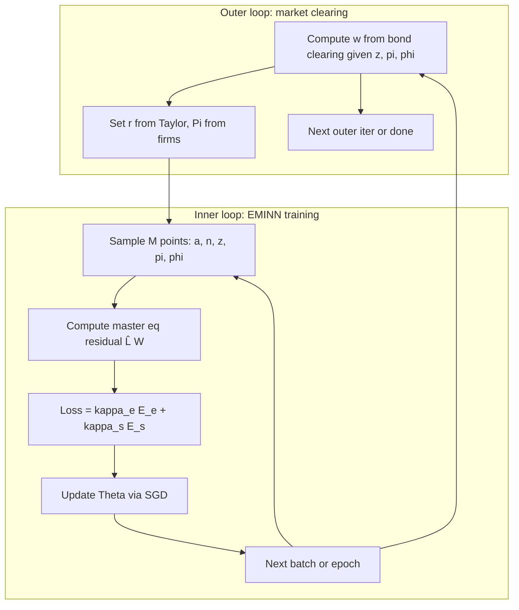

---

## 0. Primitives and calibration

### 0.1 Model primitives (from main.tex)

- **Households**: Continuum $i \in [0,1]$; individual state $(a, n)$ with $a \geq \underline{a}$; employment $n \in \{n_1, n_2\}$ driven by Poisson intensities $\lambda(n)$; no labor or portfolio choice; profits and adjustment-cost rebate distributed equally; beliefs $(\tilde{r}, \tilde{w}, \tilde{\Pi})$.
- **Firms**: Final good CES($\epsilon$); intermediate goods $Y_j = Z n_j$; log TFP $z = \log Z$ with **$dz = \mu_z(z)\,dt + \sigma_z\,dW^0$** (Brownian-driven diffusion; drift $\mu_z$ unspecified in theory); Rotemberg cost $(\psi/2)\pi^2 Y$; NKPC; $r = r^* + (\phi_\pi - 1)\pi$ from Taylor + Fisher.
- **Equilibrium**: Labor market $Y/e^z = N^* = \sum_j n_j \int g(a,n_j)\,da$; bond market $\sum_j \int a\,g(a,n_j)\,da = 0$; goods market redundant; wage $w$ from bond clearing given $(z, \pi, g)$.

### 0.2 Calibration table

| Parameter                       | PS3 / Seung source                      | Deep HANK use                                                     | Note                                         |
| ------------------------------- | --------------------------------------- | ----------------------------------------------------------------- | -------------------------------------------- |
| $\gamma$                        | 2.1                                     | 2.1                                                               | CRRA                                         |
| $\rho$                          | 0.05                                    | 0.05                                                              | Discount                                     |
| $r$                             | 0.06 (PS3), 0.012 (Seung eq)            | —                                                                 | Endogenous: $r = r^* + (\phi_\pi-1)\pi$      |
| $w$                             | 1.0 (PS3), 1.15 (Seung)                 | Endogenous via bond clearing                                      |                                              |
| $n_1, n_2$                      | 0.3, $1 + (\lambda_2/\lambda_1)(1-n_1)$ | 0.3, $1 + (\lambda_2/\lambda_1)(1-n_1)$                           | Two-state labor                              |
| $\lambda_1, \lambda_2$          | 0.4, 0.4                                | 0.4, 0.4                                                          | Poisson intensities                          |
| $\underline{a}$                 | 1e-6 (PS3), 1e-2 (Seung)                | **$-2.0$**                                                        | Allow borrowing; soft penalty below $a_{lb}$ |
| $a_{max}$                       | 20                                      | 20                                                                | Upper wealth                                 |
| $a_{lb}$ (penalty threshold)    | 0.5 (PS3), 1.0 (Seung)                  | **$0.0$** $\Rightarrow$ penalty active on $[-2, 0]$              |                                              |
| $\kappa$                        | 3.0                                     | 3.0                                                               | Penalty curvature                            |
| $\epsilon$                      | —                                       | **6**                                                             | Elasticity of substitution                   |
| $\psi$                          | —                                       | **1**                                                             | Rotemberg cost (low $\Rightarrow$ flexible)  |
| $\phi_\pi$                      | —                                       | **1.75**                                                          | Taylor rule coefficient                      |
| $r^*$                           | —                                       | **0.02**                                                          | Neutral real rate                             |
| $\mu_z, \sigma_z$               | —                                       | See §0.3                                                          | Theory: $dz = \mu_z(z)dt + \sigma_z dW^0$    |
| $N$ (agents)                    | —                                       | **25**                                                            | Finite population; LLN for aggregates        |

**Parameters that do not apply**: $\alpha$, $\delta$ (no capital in this HANK).

### 0.3 TFP process — theory vs KS / GLMP

- **Theory (main.tex)**: “Only Brownian TFP shocks” and $dz_t = \mu_{zt}\,dt + \sigma_z\,dW_t^0$. The **shock** is Brownian; the **drift $\mu_z(z)$** is not specified.
- **08-SolvingKS**: Uses **Ornstein–Uhlenbeck** $\mu_z(z) = \eta(\bar{z} - z)$ in the Lz operator and in simulation.
- **GLMP**: Generic $dz_t = \mu_z(z_t)dt + \sigma_z(z_t)dB_t^0$.
- **Decision**: State theory as $dz = \mu_z(z)\,dt + \sigma_z\,dW^0$. For implementation we use **OU**: $\mu_z(z) = \eta(\bar{z}-z)$ to align with 08-SolvingKS and keep $z$ bounded. Calibrate $\sigma_z$, $\eta$, and $\bar{z}$.

### 0.4 Utility: CRRA vs log

We adopt **CRRA** $u(c) = c^{1-\gamma}/(1-\gamma)$ with $\gamma = 2.1$ (PS3/Seung). **Log** ($\gamma \to 1$) would dampen precautionary saving (prudence $\gamma+1$), distributional curvature of $u'(c)$, and flexibility in EIS ($= 1/\gamma$); we do not use it for this exercise.

### 0.5 Aggregate variables from distribution (why $N=25$ suffices)

- **$N^*$** = labor supply from $g$; finite population: $(1/N)\sum_i n^i \to N^*$.
- **Bond clearing** $\Rightarrow$ wage $w(z,\pi,\phi)$: $0 = (1/N)\sum_i a^i$; $w$ is determined so savings decisions are consistent.
- **LLN**: 20–40 agents suffice for moments that matter for pricing (08-SolvingKS); we sample $(a,n)$ and $\phi$ separately so we can focus training where curvature is high.

---

## 1. Soft penalty function

We replace the hard borrowing constraint $a \geq \underline{a}$ with a **soft penalty** so the NN sees a differentiable objective (GLMP §2.2; PS3).

- **Formula**: $\psi(a) = -\frac{\kappa}{2}(a - a_{lb})^2$ for $a \leq a_{lb}$, and 0 otherwise. Choose $a_{lb} > \underline{a}$ so the penalty is active on a nontrivial band $[\underline{a}, a_{lb}]$.
- **In the HJB**: Add $1_{a \leq a_{lb}}\,\psi(a)$ in the **V**-residual, or $1_{a \leq a_{lb}}\,\partial_a\psi(a)$ in the **W**-residual ($\partial_a\psi = -\kappa(a - a_{lb})_+$).

---

## 2. Envelope and FOC: work with $W = \partial_a V$

Following 08-SolvingKS p.6 we approximate **$W(a,n,z,\pi,g) = \partial_a V$** instead of $V$. Then:

- **Optimal consumption**: $u'(c^*) = W \Rightarrow c^* = (u')^{-1}(W)$.
- **Master equation in $W$**: The drift term $\partial_a V \cdot s$ becomes $W \cdot s$; terms in $\partial_a(\cdots)$ become $\partial_a W \cdot s + W \cdot \partial_a s$ as needed. All derivatives in the residual are obtained by autodiff on the NN that outputs $W$ (or $V$ from which $W$ is derived).

This keeps the control explicit and avoids embedding the FOC inside the PDE.

---

## 3. Gaps between theory and deep learning

- **Infinite-dimensional $g$**: Replaced by finite population $\phi = (a^i, n^i)_{i \leq N}$ with $N = 25$.
- **Hard borrowing constraint**: Replaced by soft penalty (§1).
- **Boundary at $\underline{a}$**: Softer; optionally add a boundary residual term (08-SolvingKS p.19).
- **Fréchet derivative $\partial V/\partial g$**: In finite population, $g$ is replaced by an empirical measure, so the functional derivative becomes an **average** over other agents: $(N-1)^{-1}\sum_{j \neq i}$ of derivatives w.r.t. $(a^j, n^j)$ (08-SolvingKS Ingredient 1a).
- **Market clearing**: $w$ (and $r$) determined in equilibrium; in code either via an outer loop that solves for $w$ or by “last agent” sampling (§6).
- **Itô terms in $(z, \pi, \phi)$**: Second-order terms in aggregate state; in our setting only $z$ and $\pi$ contribute second derivatives (§10).

---

## 4. NN strategy roadmap

### 4a. Simulation algorithm and transition matrix

Following 08-SolvingKS (simulation steps): (1) Start from initial $g_0$ (e.g. ergodic). (2) For each time step: draw $\Delta B^0$, update $z$; for $k=1,\ldots,N_{sim}$ draw $N$ agents from $g_t$; at $(z_t, \phi_t^k)$ get $r_t^k, w_t^k$; average to $\bar{r}_t, \bar{w}_t$; at grid points $a_m$ get $\hat{c}(\cdot)$; build **transition matrix $A_t$** from the KFE; update $g_{t+\Delta t} = (I - A_t^\top \Delta t)^{-1} g_t$ (implicit).

**Transition matrix in our context**: Discretization of the KFE operator. Our KFE is $\partial_t g = -\partial_a(s g) + \lambda(\check{n}) g(a,\check{n}) - \lambda(n) g(a,n)$. On a grid in $a$ and two $n$ states, $A_t$ is the matrix such that the discretized evolution is $d\phi/dt = A_t^\top \phi$, with finite differences in $a$ and Poisson terms for $n$. So $A_t$ encodes advection ($s$) and employment switching.

### 4b. NN setup

- **Inputs**: $\omega = (a^i, n^i, z, \pi, \phi^{-i})$ or $(a, n, z, \pi, \phi)$ with $\phi = (a^j, n^j)_{j \leq N}$. For symmetry, agent $i$ sees $\phi^{-i}$ for pricing (GLMP 3.1).
- **Output**: $W(\omega)$. Output activation: e.g. softplus for positivity (08-SolvingKS p.15).
- **Architecture**: Fully connected feedforward; e.g. 5 hidden layers, 64 units, tanh; input normalization for $(a, n, z, \pi)$.

### 4c. EMINN algorithm — what is computed by autodiff

- **Algorithm**: Initialize $\Theta$; while loss $> \varepsilon$: sample $M$ points $(a, n, z, \phi)$; compute $E = \kappa_e E_e + \kappa_s E_s$; $\Theta \leftarrow \Theta - \alpha \nabla_\Theta E$.
- **$E_e$**: Mean squared master-equation residual $|\widehat{L} W|^2$ at sample points.
- **Objects from autodiff**: (i) $W$ and $\partial_a W$, $\partial_z W$, $\partial_\pi W$; (ii) $\partial_{a^j} W$ for $j \neq i$ (for $\widehat{L}_g$); (iii) for shape penalties, $\partial_{aa} V$, $\partial_{za} V$ if using $V$. All derivatives in $\widehat{L}$ come from the same graph as the NN output.
- **Shape constraints**: $E_s$ penalizes wrong shape: e.g. $\partial_{aa} V < 0$, $\partial_{za} V < 0$ (08-SolvingKS table p.20); for $W$, $W$ decreasing in $a$ where appropriate. Use $\kappa_e = 100$, $\kappa_s = 1$ as in 08-SolvingKS finite-agent.

### 4d. Warm-start and curriculum

- **Warm-start**: Fit to marginal utility at hand-to-mouth: $W_0(a,n) = u'(c_{ss}) = c_{ss}^{-\gamma}$ where $c_{ss} = w_{ss} n + r_{ss} a + \Pi_{ss}/N$, with steady-state $(r_{ss}, w_{ss}, \Pi_{ss})$. This avoids the $r/\rho$ chain-rule issue of deriving $W_0$ from a value function $V_0$. Reduces initial residual and improves conditioning.
- **Curriculum**: (1) Train on warm-start loss only; (2) blend $\alpha\,\text{warmstart\_loss} + (1-\alpha)\,\text{pde\_loss}$ with $\alpha$ decaying 1 → 0 (PS3); (3) then pde_loss only. Optionally start with smaller $\sigma_z$ or no $\pi$ then ramp up.

---

## 5. Implementation tricks

### 5a. From 08-SolvingKS and Seung

- **08-SolvingKS**: Moment sampling for $\phi$; active sampling for $(a,n)$; shape penalties $\partial_{aa} V, \partial_{za} V < 0$; initialization $W(a,\cdot) = e^{-a}$ or similar; boundary oversampling (PS3 boundary_frac); gradient clipping; cosine LR decay.
- **Seung (nn_finag)**: $N_{pop}=41$; steady-state distribution from FD; Beta-sampling for moments ($k_{impl}$, var_a); closed-form $\text{calc\_eqm}(Z, L, k) \to r, w$; mixture of uniform and moment-consistent samples. (Note: Seung uses no outer loop and no last-agent; prices are closed-form given $k = \text{mean}(a_{\text{oth}})$. Our model has no such closed form for $w$, so we need an outer loop and/or last-agent in sampling.)

### 5b. Sampling most suited to our setting

- **Recommendation**: **Moment-based sampling for $\phi$** (08-SolvingKS, GLMP). Our prices $(w, r)$ depend on bond clearing (mean assets 0) and labor $N^*$. (1) Draw $z$, $\pi$ (and optionally moments). (2) Draw $N-1$ agent states $(a^j, n^j)$ consistent with zero mean assets and target $N^*$. (3) **Set last agent’s state or rescale** so $\sum_i a^i = 0$. This keeps training in the economically relevant subspace.
- **(a, n)**: Uniform over $[\underline{a}, a_{max}] \times \{n_1, n_2\}$ plus boundary oversampling near $\underline{a}$ and $a_{lb}$ (PS3).
- **z, $\pi$**: Uniform over $[z_{min}, z_{max}]$, $[\pi_{min}, \pi_{max}]$ or from a simple law of motion.

### 5c. Avoiding cheat solutions

- **Cheat solutions**: Constant $V$, non-increasing in $a$, non-concave (08-SolvingKS p.19).
- **Mitigations**: (1) Shape penalties $E_s$. (2) Warm-start toward sensible $V_0$. (3) Initialize so $W$ is decreasing in $a$ (e.g. $e^{-a}$). (4) Boundary oversampling. (5) Curriculum so the solver first fits a good shape then refines residual.

### 5d. Calibration / init / algorithm (from 08-SolvingKS)

- **Calibration**: If training is unstable, reduce $\sigma_z$ or shrink $(z, \pi)$ range; or train first with fixed $z$ (Aiyagari-like) then add aggregate shocks.
- **Initialization**: As in 08-SolvingKS table; avoid zeros that lead to flat gradients.
- **Algorithm**: Howard-style iteration (fix policy, update $V/W$) can help; consider $\kappa_e > \kappa_s$ early then balance.

---

## 6. Inflation and market clearing — outer loop and “last agent”

### 6.1 Inflation in our model

$\pi$ is an aggregate state with NKPC (main.tex):
$$
d\pi_t = \Big[ r^* \pi_t + (\phi_\pi - 1)\pi_t^2 + \frac{\epsilon}{\psi}\Big( \frac{\epsilon-1}{\epsilon} - \frac{w_t}{e^{z_t}} \Big) - \Big( \mu_{zt} - \frac{1}{2}\sigma_z^2 \Big) \pi_t \Big] dt - \sigma_z \pi_t\,dW_t^0.
$$
So $\pi$ is not a market-clearing price in the same way as $w$; it evolves by NKPC and belief consistency.

### 6.2 Market clearing

- **Labor**: $Y/e^z = N^*$ (and $N^*$ from $g$).  
- **Bond**: $0 = \sum_j \int a\,g(a,n_j)\,da$ pins down **$w$** given $(z, \pi, g)$ — the wage at which household saving decisions clear the bond market. In finite population: $0 = (1/N)\sum_i a^i$; $w$ is the price that achieves this in equilibrium.

### 6.3 Outer loop (GLMP-style)

Master equation is solved given $q = (r, w, \Pi)$; in equilibrium $q = Q(z, g)$. **Outer loop**: (1) Given current NN ($W$ or $V$), at each sampled $(z, \pi, \phi)$ compute equilibrium $w$ (and $r$, $\Pi$) from bond clearing, with $r = r^* + (\phi_\pi - 1)\pi$. (2) Train NN to minimize residual with this $q$. (3) Iterate. So “outer” = market-clearing / equilibrium price update; “inner” = SGD on master-equation residual. **We do not have a closed-form $w(z, \pi, \phi)$** (unlike KS where $r, w$ come from production FOC given $K, L$), so we must solve for $w$ in the outer loop (or by a fixed-point within the batch).

### 6.4 “Last agent” trick

Instead of only solving $0 = (1/N)\sum_i a^i$ for $w$, we can **fix $N-1$ agents’ $(a^j, n^j)$** and set $a^N = -\sum_{i=1}^{N-1} a^i$ so the **distribution** clears by construction. The $N$th agent’s state is then determined; their consumption/saving is implied. **Why it helps**: (1) Ensures every batch satisfies $\sum_i a^i = 0$. (2) Reduces need to invert “$w$ given $\phi$” when sampling. (3) Can stabilize learning by avoiding inconsistent $(\phi, w)$ pairs. **Caveat**: Agent $N$ is a computational device; the **outer loop still solves for $w$** (the wage at which that state is an equilibrium). The standard alternative is GLMP’s price-taking $Q(z, \phi^{-i})$ with an outer loop that computes $w$ from clearing.

---

## 7. Where to sample — diagnostic output

**Mechanism (active sampling, 08-SolvingKS, Gopalakrishna)**: Periodically evaluate the master-equation residual on a fixed or random grid; record residual by region (e.g. bins of $(a, n, z, \pi)$). Output a **test report**: (1) MSE of residual by $(a_{bin}, n)$, (2) max residual and its location $(a^*, n^*, z^*, \pi^*)$, (3) histogram of residuals. This informs where to add more samples in the next training phase.

**Concrete test output**: A table or plot with columns $(a_{bin}, n, z_{bin}, \pi_{bin})$, rows (mean_residual, max_residual, count); or a 2D map of mean residual in $(a, z)$ for fixed $n, \pi$. Log every $K$ epochs and optionally feed high-error cells into the sampler.

---

## 8. Outer vs inner loops (Mermaid)

**Inner**: Sample → residual → loss (with shape) → SGD; repeat. **Outer**: Given current NN, recompute equilibrium $(w, r, \Pi)$ from clearing; then resume inner or alternate.

---

## 9. Other important points from 08-SolvingKS

- **Testing**: Compare to a known solution (e.g. Aiyagari with fixed $z$): MSE of $V$ or $W$ vs finite difference (08-SolvingKS p.22).
- **Howard improvement**: Fix policy $c^*$ for several iterations and only update $V/W$ to stabilize (08-SolvingKS p.21).
- **Symmetry / dimension reduction**: Optional NN that maps $\phi$ to moments then $(a, n, z, \text{moments}) \to V$; we can start without it (08-SolvingKS p.21).
- **Boundary**: Soft penalty preferred; if adding boundary residual, sample on $a = \underline{a}$ and add $E_b$ to loss (08-SolvingKS p.19).
- **Practical lessons (08-SolvingKS p.31)**: Sampling is critical; smooth constraints help; shape constraints help speed and stability; start from a simpler (e.g. no aggregate shock) model to tune.

---

## 10. Itô terms in our setting

**General concern**: The master equation has terms $D_s W^\top \mu(s) + \frac{1}{2}\operatorname{Tr}(\sigma(s)^\top D_s^2 W\,\sigma(s))$ for $s = (z, \pi, \phi)$. With high-dimensional $\phi$, many second derivatives could be costly.

**In our setting**: (1) **z**: One-dimensional; $\partial_z W$, $\partial_{zz} W$ cheap. (2) **$\pi$**: One-dimensional; $\partial_\pi W$, $\partial_{\pi\pi} W$ cheap. (3) **Cross $z \times \pi$**: Since $dz$ and $d\pi$ share the **same** Brownian $dW^0$, there is a cross Itô term $-\sigma_z^2\pi\,\partial_{z\pi}^2 W$. This is a single mixed second derivative, cheap via autodiff. (4) **$\phi$**: $\widehat{L}_g$ involves $\partial_{a^j} W$ — **first derivatives only** in $\phi$; there is no second-order Itô term in $\phi$ because agent states evolve by drift + Poisson (no diffusion in $a^i$). So the second-order terms are $\partial_{zz} W$, $\partial_{\pi\pi} W$, and $\partial_{z\pi}^2 W$, all manageable.

**Conclusion**: Itô terms are **not** a major concern: no diffusion in $\phi$, and the $(z, \pi)$ block is 2D with one cross-term $-\sigma_z^2\pi\,\partial_{z\pi}^2 W$ from the shared Brownian (included in PDE residual, see §A). If we later use a projection in $\phi$ (e.g. moments), Duarte’s $F(\varepsilon)$ trick (08-SolvingKS p.30) can reduce the derivative count for the Itô correction in that subspace.

---

## Master equation (reference, from main.tex)

State dynamics:
$$
s(a,n,z,\pi,g) = r(z,\pi,g)\,a + w(z,\pi,g)\,n - (u')^{-1}[\partial_a V] + \Big[ \Big(1 + \frac{\psi}{2}\pi^2\Big) e^z - w(z,\pi,g) \Big] N^*,
$$
$$
\mu_\pi(z,\pi,g) = r^* \pi + (\phi_\pi - 1) \pi^2 + \frac{\epsilon}{\psi}\Big( \frac{\epsilon-1}{\epsilon} - \frac{w(z,\pi,g)}{e^z} \Big) - \Big( \mu_z(z) - \frac{1}{2}\sigma_z^2 \Big) \pi,
$$
$$
\mu_g(a,n; z,\pi,g) = -\partial_a\big( s(a,n,z,\pi,g)\,g(a,n) \big) + \lambda(\check{n}) g(a,\check{n}) - \lambda(n) g(a,n),
\quad
r(z,\pi,g) = r^* + (\phi_\pi - 1)\pi.
$$

**Finite-population translation (implementation)**: In code we compute the aggregate transfer $\Pi(z,\pi,\phi)$ and add it as **$\Pi/N$** inside each agent’s $s^i$. The distribution term is implemented as an **empirical-measure average** over other agents, i.e. $(N\!-\!1)^{-1}\sum_{j\neq i}[\cdot]$, consistent with $g^{N,-i} = \frac{1}{N-1}\sum_{j\neq i}\delta_{(a^j,n^j)}$.

The master equation in $V$ is $\rho V = \text{(flow utility + FOC)} + \partial_a V \cdot s + \lambda(n)(V(a,\check{n},\cdot) - V(a,n,\cdot)) + \mu_z \partial_z V + \frac{1}{2}\sigma_z^2 \partial_{zz} V + \mu_\pi \partial_\pi V + \frac{1}{2}\sigma_z^2 \pi^2 \partial_{\pi\pi} V - \sigma_z^2 \pi\,\partial_{z\pi}^2 V + \text{(distribution term)}$, with boundary constraint $u'[w n + r \underline{a} + \cdots] \leq \partial_a V(\underline{a}, n, \ldots)$. In practice we use the soft penalty (§1) and the $W = \partial_a V$ formulation (§2) with finite population (§3–4).

<!-- amp-managed -->
